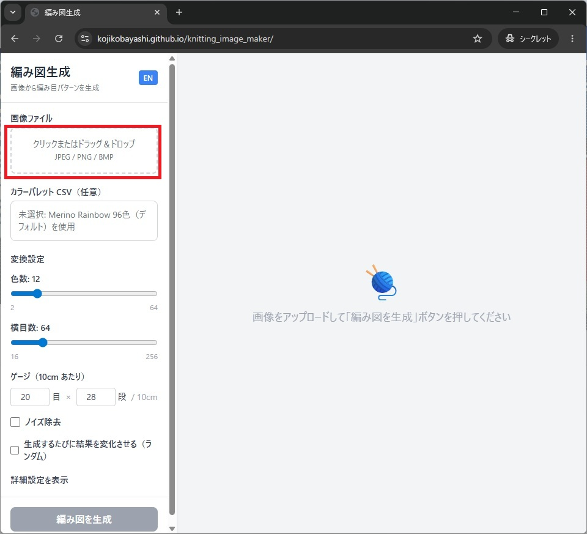
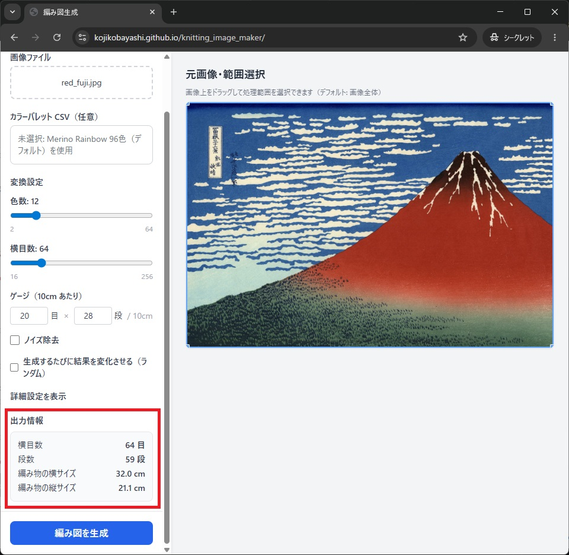
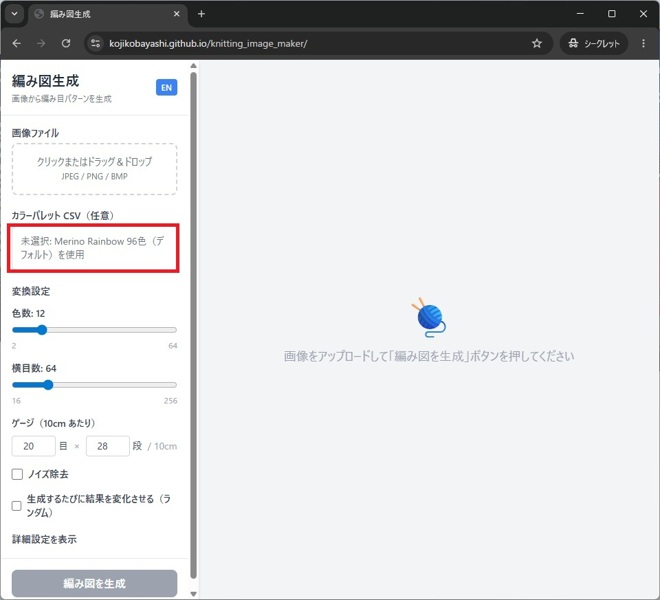
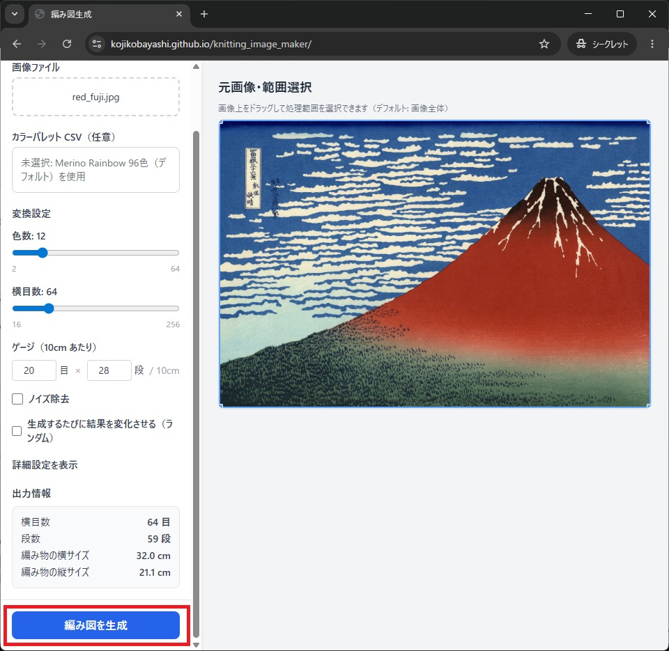
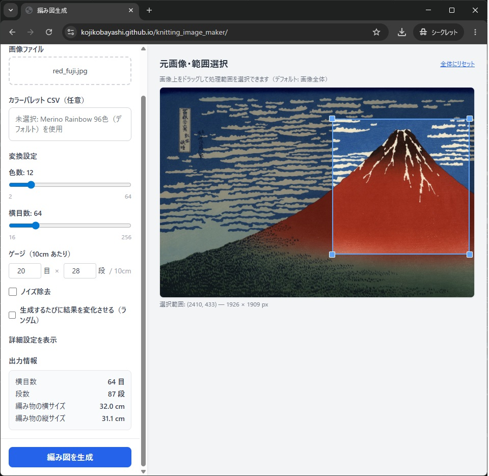
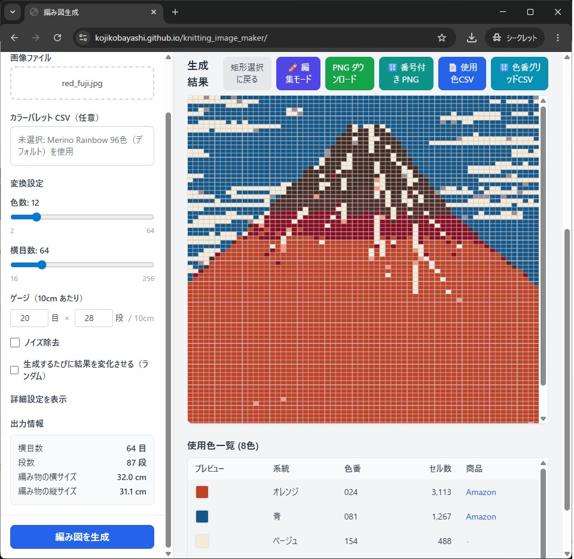

## 最短手順

1. 画像をアップロードする
2. 必要ならパレット CSV を読み込む
3. 編み図生成ボタンを押す
4. 結果を確認する
5. 解析範囲に関して

## 1. 画像をアップロードする

まずアップロードボタンから元画像を読み込みます。

## 2. パレット CSV を読み込む（必要な場合）

使いたい糸色の候補を限定したいときは、パレット CSV を読み込みます。

## 3. 編み図を生成する

編み図生成ボタンを押して変換を実行します。

## 4. 結果を確認する

右側の結果領域で見た目を確認し、必要なら後続の記事で紹介する調整を行います。

## 5. 解析範囲について

画像の一部分をくりぬきたい場合は、読み込んだ画像上をマウスドラッグで四角を指定できます。

