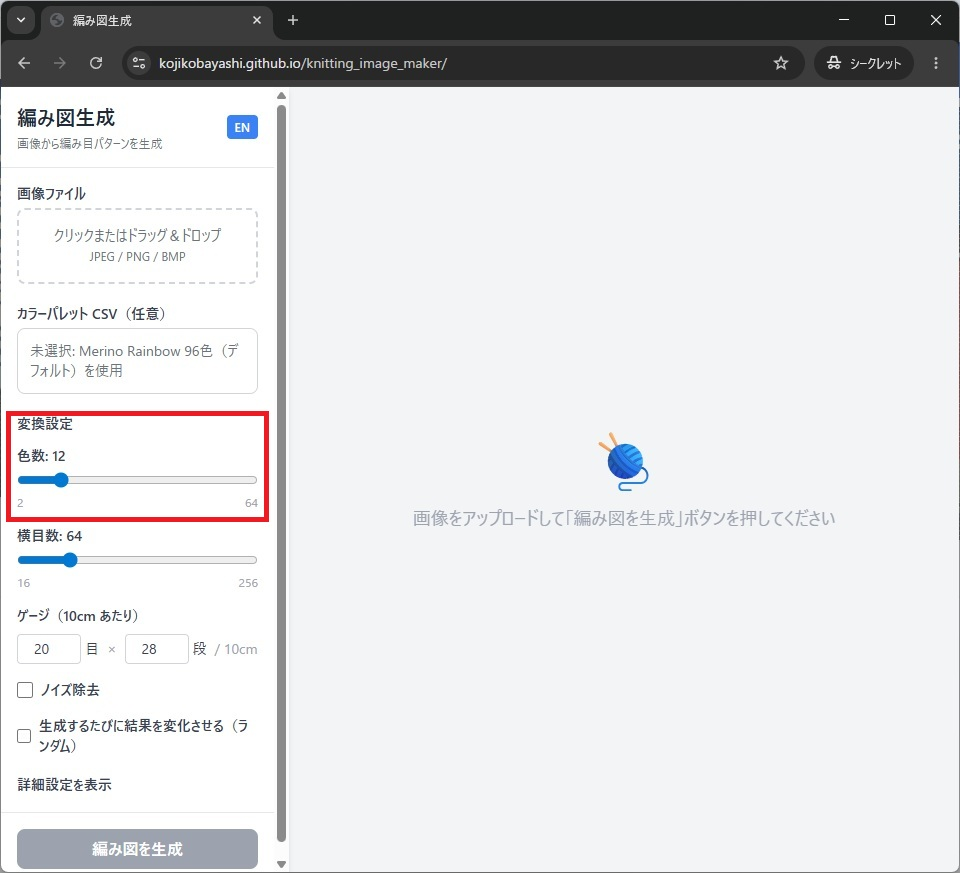
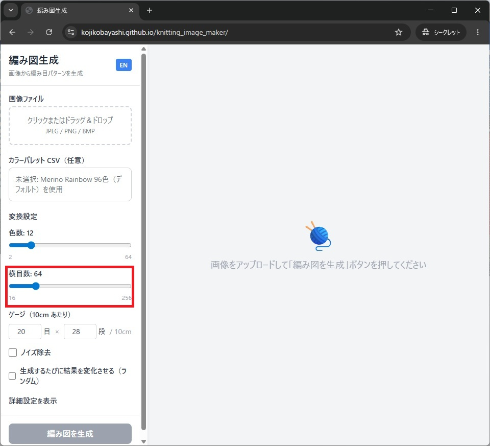
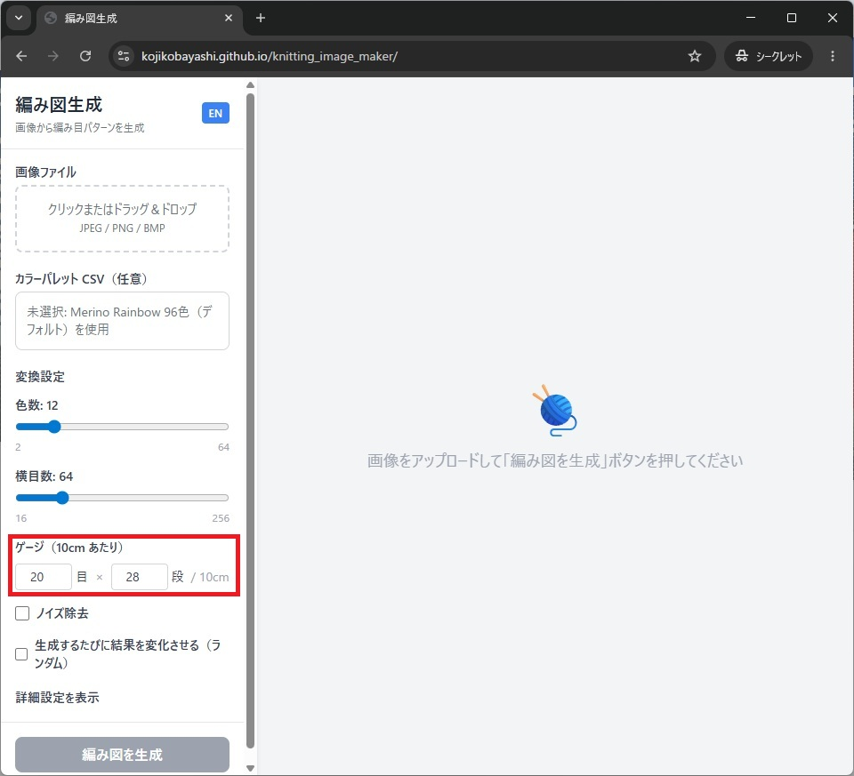
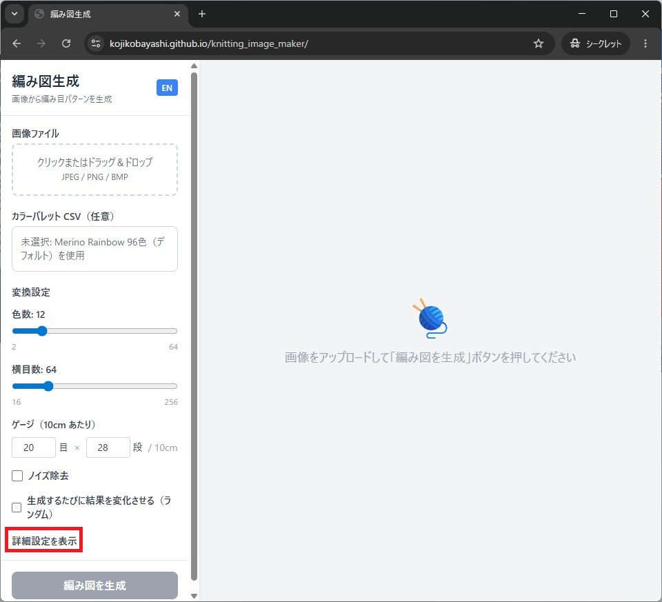
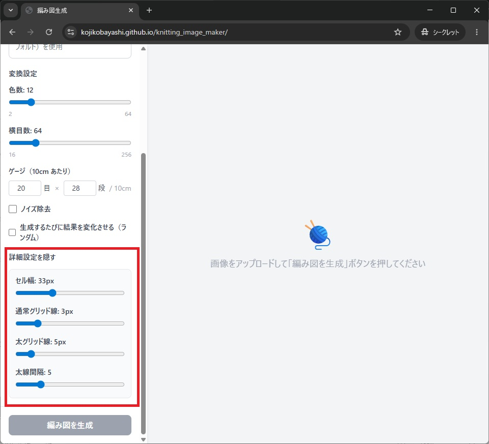

## 調整項目 1: 使用色数

使用色数を減らすとシンプルになり、増やすと元画像に近づきます。  
作りたい作品サイズや使える糸の種類に合わせて決めます。

## 調整項目 2: 横方向の目数

横方向の目数を変えると、図案の密度と見え方が変わります。  
まず大きく調整し、その後に細部を詰めると作業しやすくなります。

## 調整項目 3: ゲージ

ゲージ設定は、実際に編んだときのサイズ見積もりに関わります。  
完成サイズを意識する段階で必ず確認します。

### 詳細設定について

最終的な編み図の見た目を調整することができます。

- セル幅：網目の幅に割り当てるピクセル数
- 通常グリッド線：網目を区切る線（グリッド線）の太さ（ピクセル数）
- 太グリッド線：一定間隔で入る太いグリッド線の太さ（ピクセル数）
- 太線感覚：何本ごとに太いグリッド線を入れるか