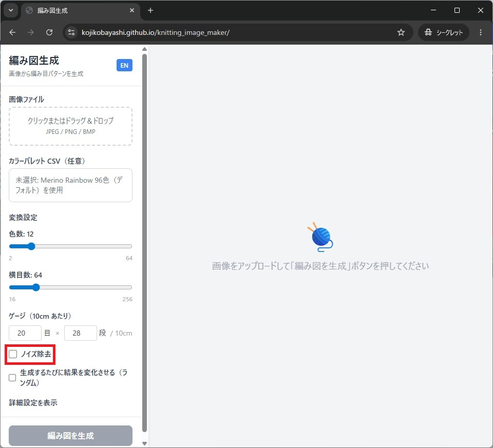
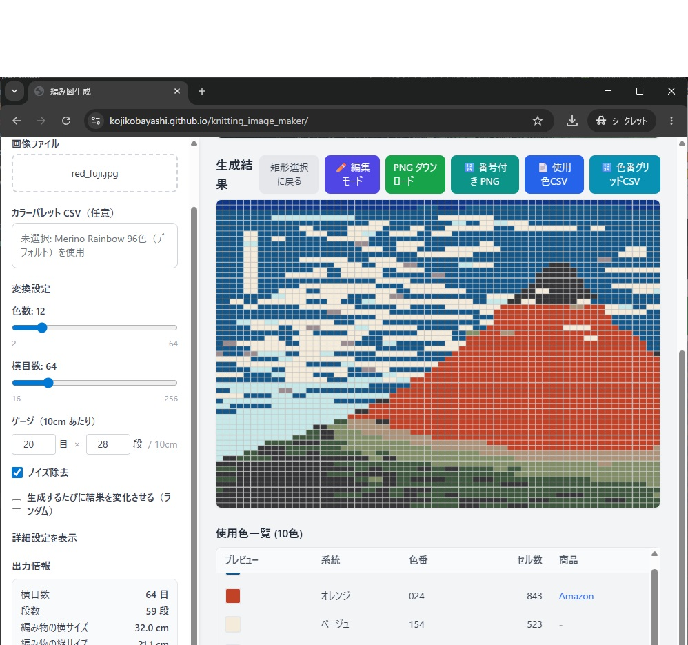
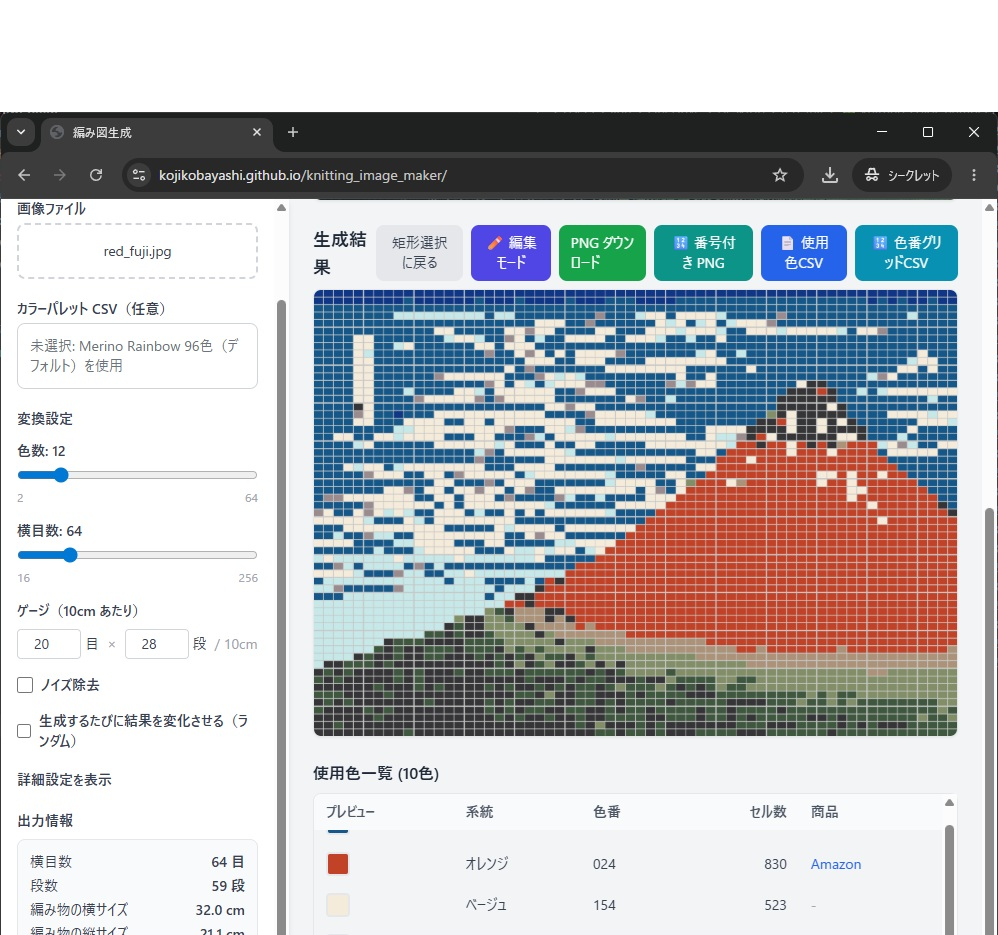

## ノイズ除去とは

細かな色のばらつきを抑え、まとまりのある図案に寄せるための機能です。  
細部の情報量と見やすさのバランスを取る目的で使います。

## 手順

1. ノイズ除去チェックボックスを確認する
2. オンの状態で結果を確認する
3. オフの状態と比較する

## 使い分けの目安

1. 模様が細かすぎて編みにくそうな場合: オン
2. 元画像の微妙な濃淡を残したい場合: オフ
3. 判断に迷う場合: 同じ設定でオン/オフ比較して採用を決める
