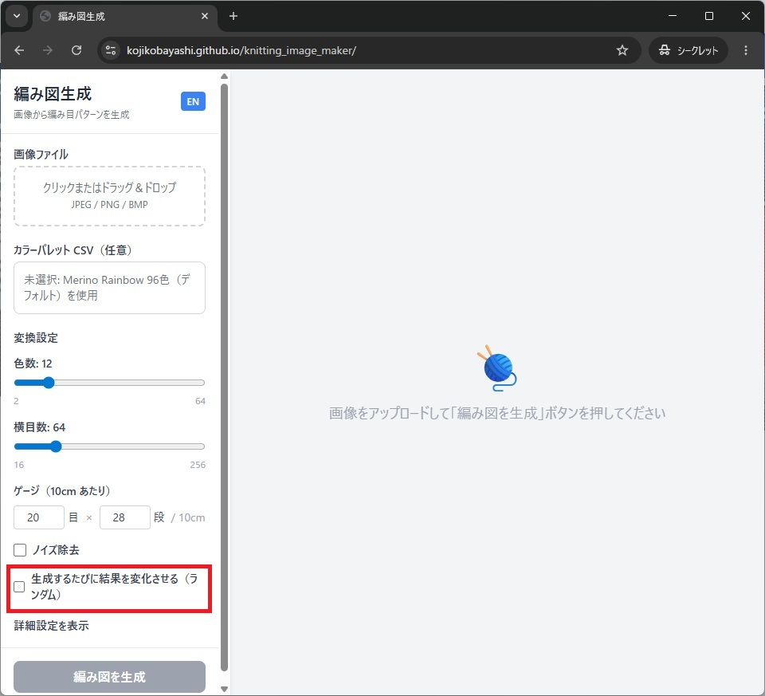
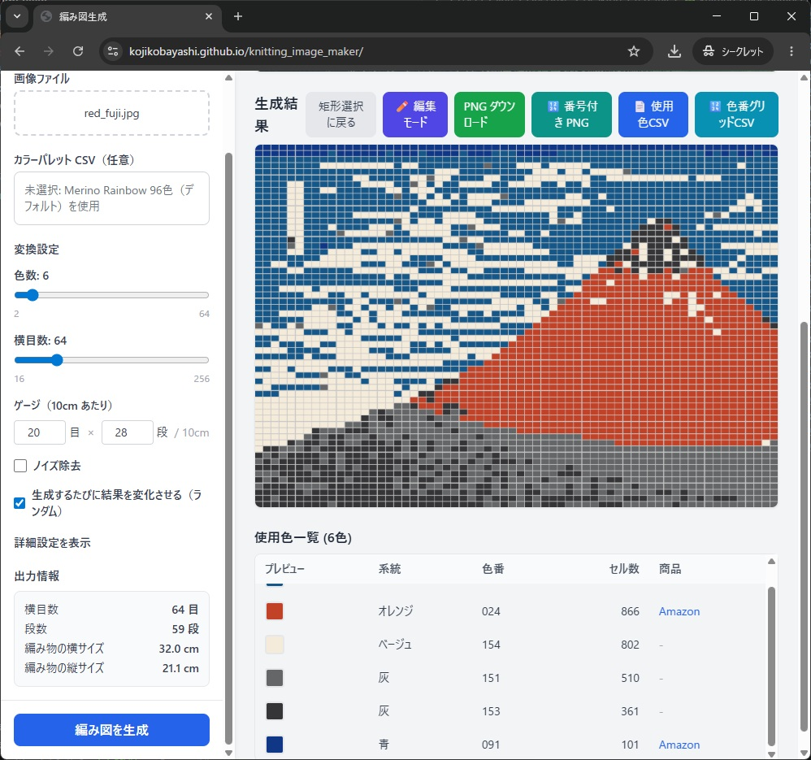
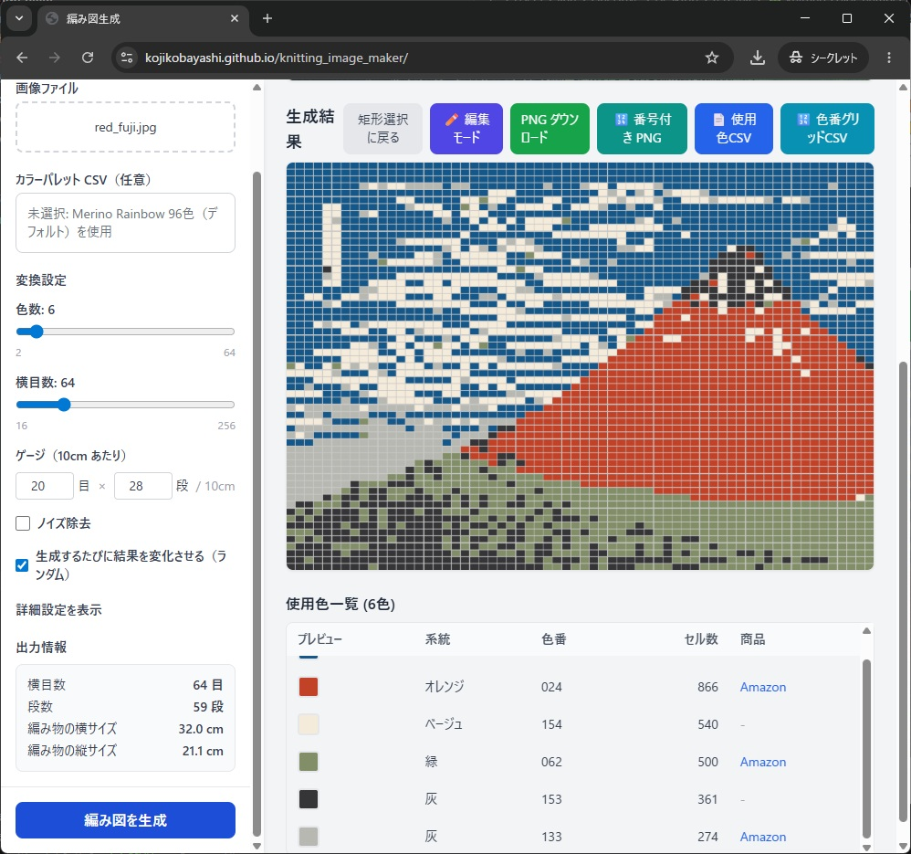
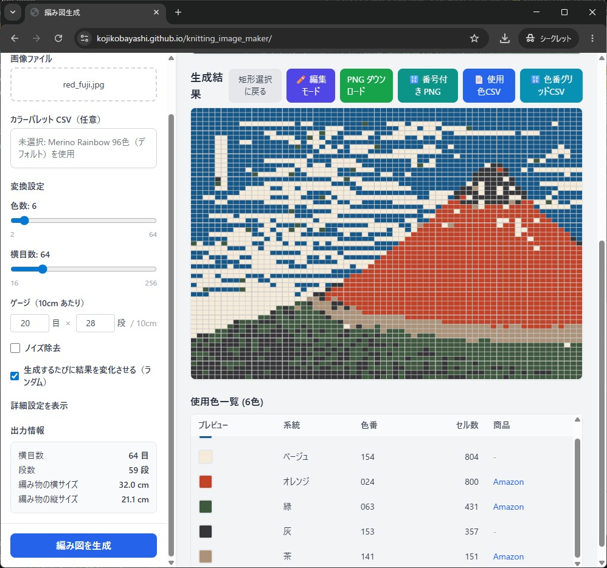

## ランダム生成の位置づけ

編み図の生成にランダムの要素入れることができます。

思ったような編み図にならない場合、ランダムな生成を繰り返して自分のイメージに近い画像が出てくるまでトライすることが可能です。

## 手順

1. ランダム結果生成のチェックを有効化する
2. 生成を実行して結果を確認する
3. 気に入ったタイミングで生成を終了する

以下のチェックボックスをオンにして、ランダム生成機能を有効にします。

これにより生成ボタンを押すたびに違う結果が生成されます。

## 注意点
小さい画像や色数が少ない場合はランダムの機能が効かない場合があります
