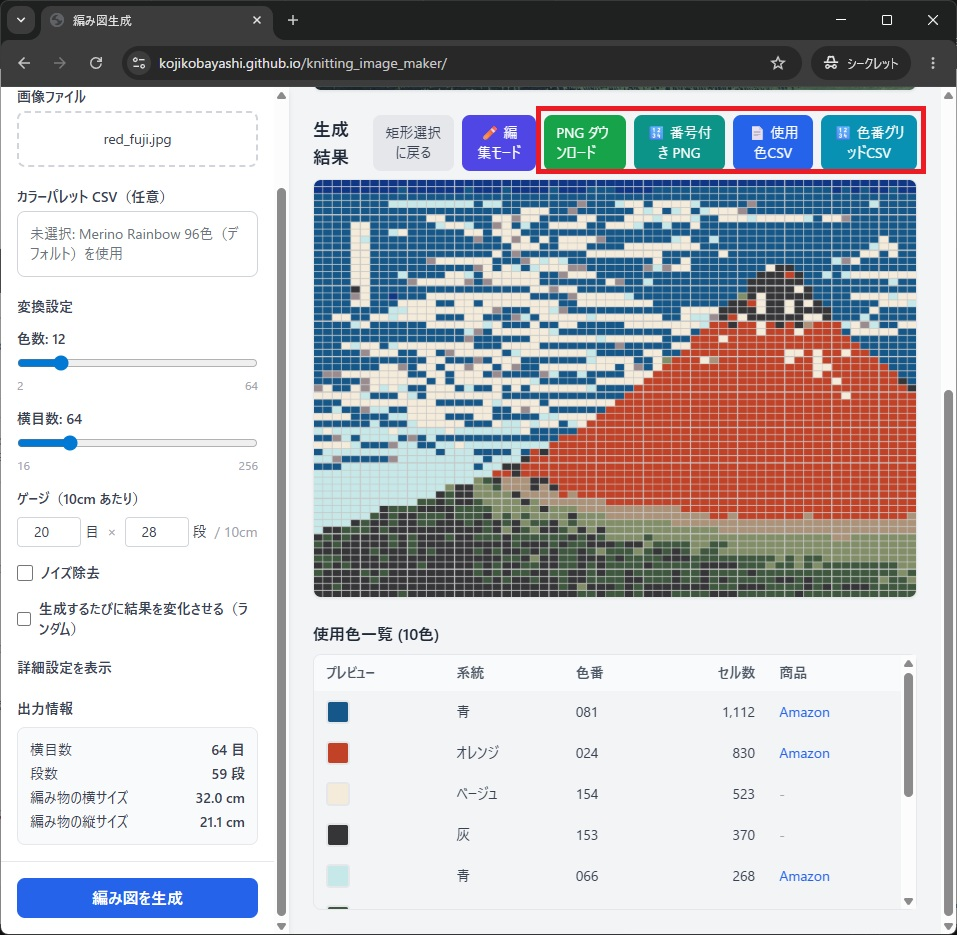
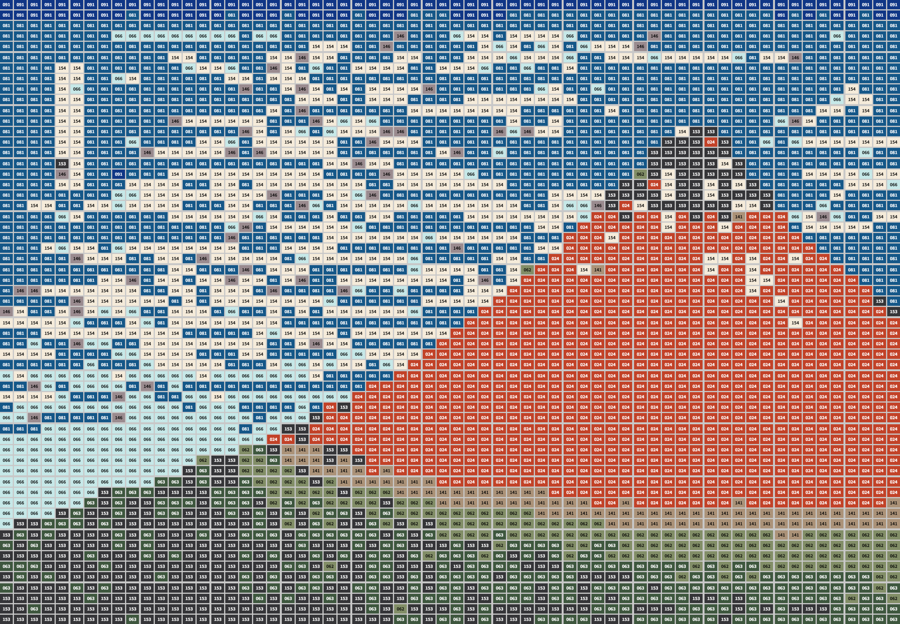
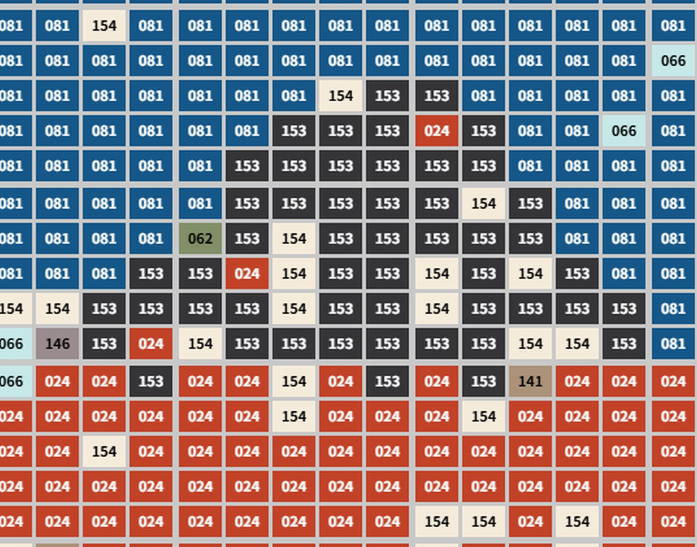

## 出力前の確認

保存前に、編み図の形式と見やすさを確認します。  
特に番号付き版は、色番号を参照しながら編むときに有効です。

## 手順

1. ダウンロードボタン群を確認する
2. 用途に応じて保存形式を選ぶ
3. 保存後に拡大して判読性を確認する

これらのボタンからダウンロードが可能です。

見た目そのままの画像を団ロードします。

各編目に使用色の番号を付加した画像をダウンロードします。番号は毛糸の色番に対応しています。

拡大するとこう見えます。

毛糸の色番はページ下部の「使用色一覧」に表示されています。
この情報は「使用色CSV」ボタンからダウンロード可能です。

編み図の色番をCSVにしたものが「色番グリッドCSV」ボタンからダウンロード可能です。
EXCEL で読み込みが可能なので、ご自身の手で修正することができます。
