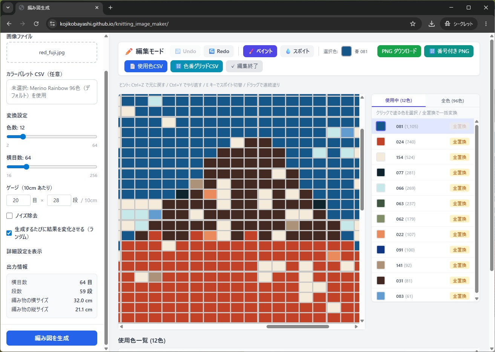
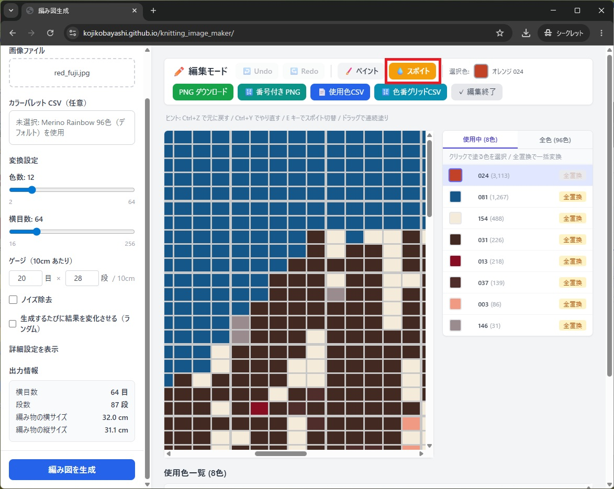
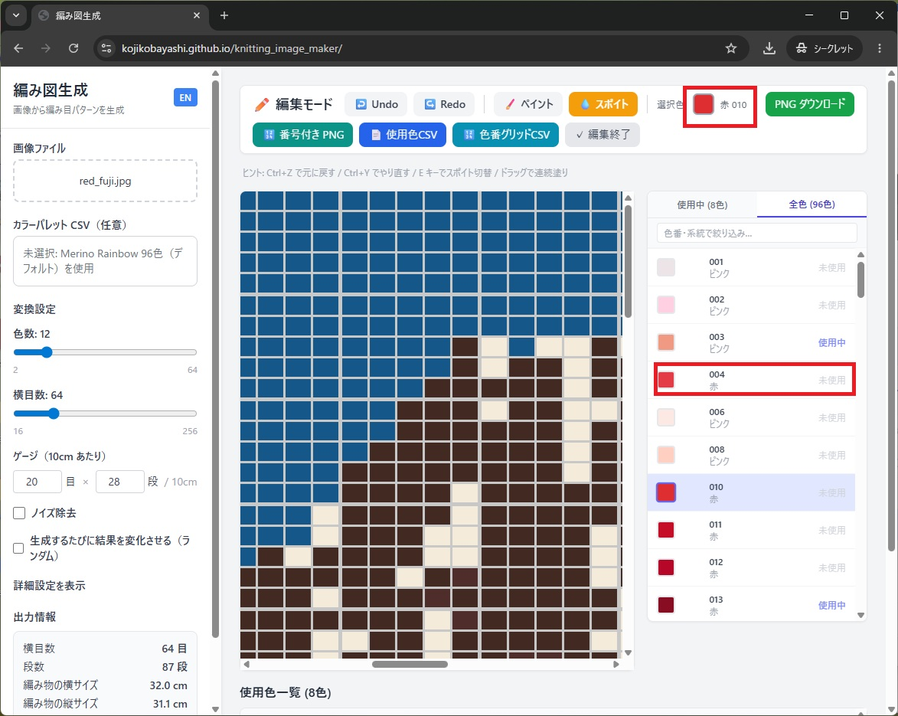
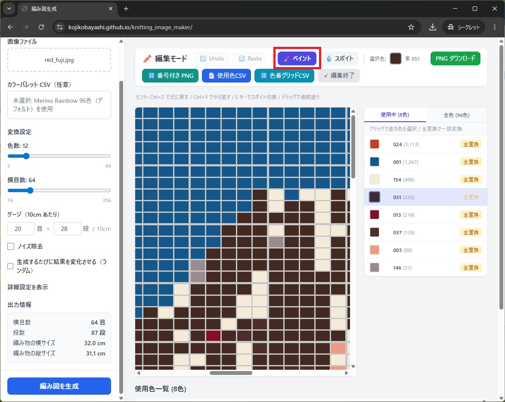
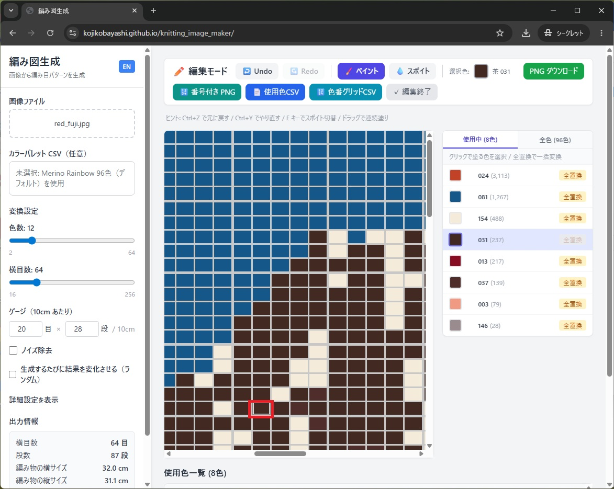
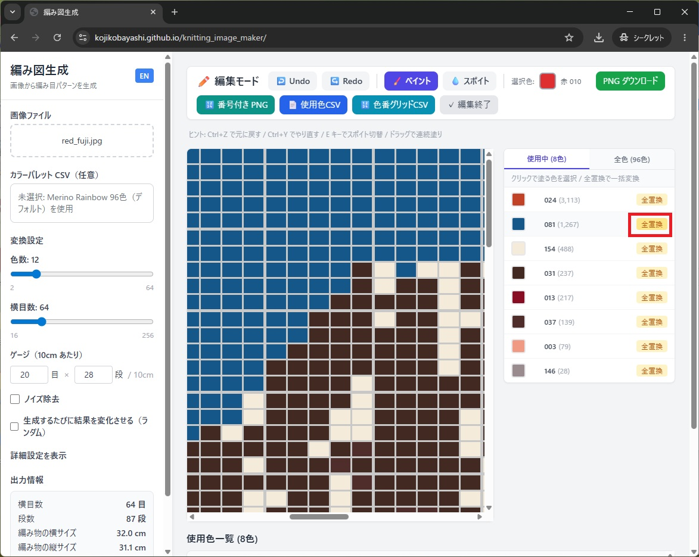
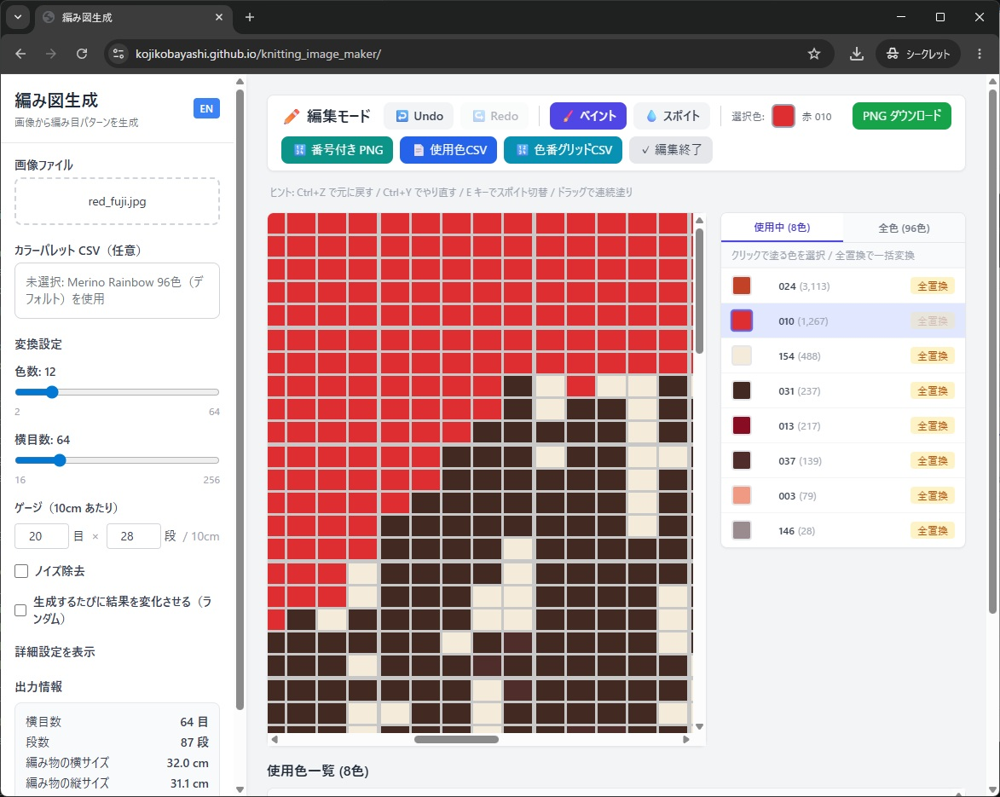
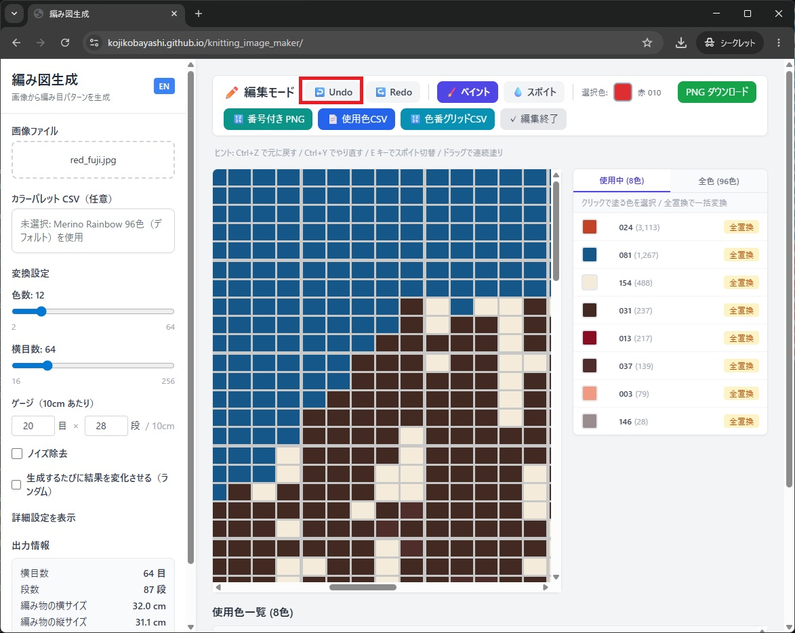
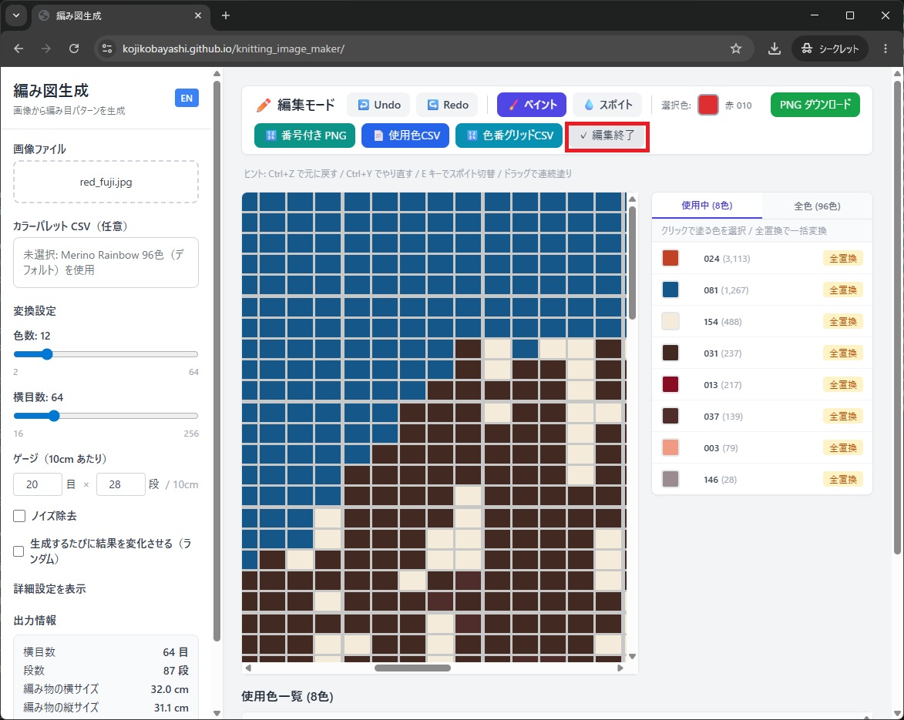
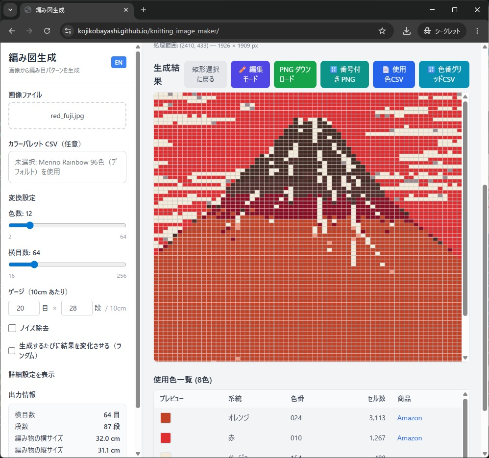

## 編集機能の流れ

1. 編集モードに入る
2. ペイントで修正する
3. スポイトで色を拾う
4. 矩形選択でまとめて編集する
5. Undo で戻す
6. 編集を終了する

「編集モード」ボタンから生成した画像を修正するモードに入れます。

## スポイト
使いたい色を選択します。
まず「スポイト」ボタンを押して、色をセットするモードにします。

毛糸一覧の色をクリックすると色が選択されます。
表示中の画像の網目をクリックしてもその色を選択できます。
選択された色は「選択色」で確認することができます。

## ペイント
選択された色で網目を塗ります。
「ペイント」ボタンを押してペイントモードにします。

画像中の網目をクリックすることで塗りつぶしが可能です。

## 全置換
特定の色の糸を、別の色の糸に置き換えることができます。
「全置換」ボタンを押すと、その色を選択中の色に置き換えます。

## Undo とRedo編集終了
間違って塗ってしまっても大丈夫です。「Undo」ボタンを押して作業を取り消すことができます。

「Redo」ボタンを押すと、先ほど取り消した作業をやり直すことも可能です。

## 編集終了時
編集を終えるときは必ず「編集終了」ボタンを押しましょう。

