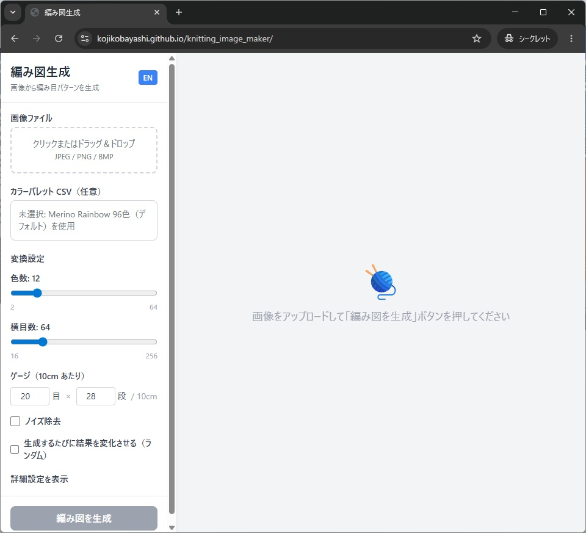
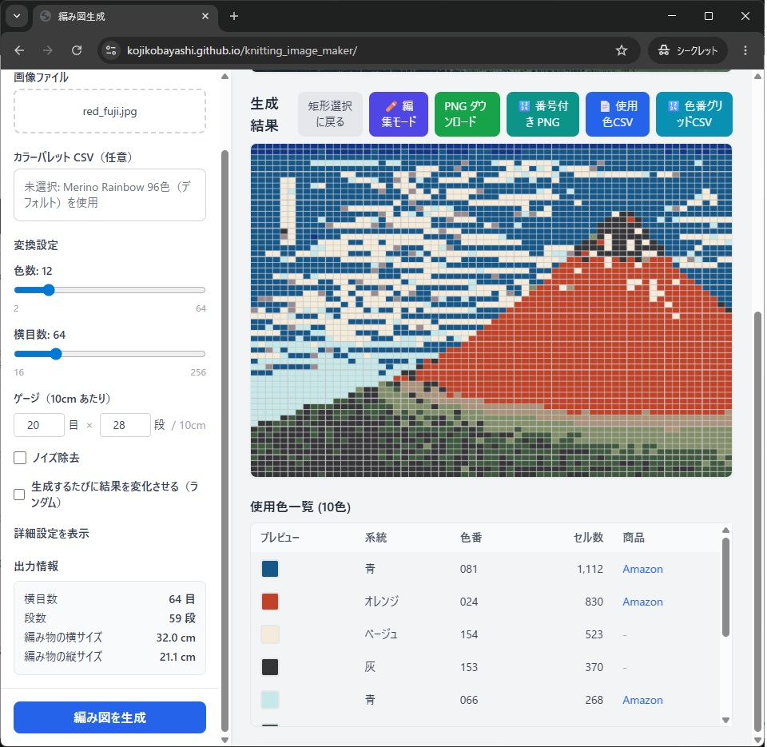

## 全体の進め方

この記事シリーズの実務的な進め方は次の順番です。

1. 画像をアップロードして初回生成する
2. 色数・目数・ゲージを調整する
3. ノイズ除去やランダム生成で比較する
4. 必要な箇所を編集モードで手直しする
5. 用途に合わせて編み図を保存する

## よくあるつまずき

1. 色数を上げすぎて図案が複雑になる  
   最初は少なめの色数で試し、必要に応じて増やすのが安全です。
2. 生成結果だけで判断してしまう  
   ノイズ除去やランダム生成の比較を行うと、より編みやすい案を選べます。
3. 編集で崩したあとに戻せない  
   こまめに Undo を使い、区切りごとに結果を確認してください。

## おわりに

最初は「簡単な使い方」の手順だけで 1 枚作り、次に調整項目へ進むと習得しやすくなります。  
慣れてきたら編集機能と比較機能を組み合わせて、作品に合わせた図案へ仕上げてください。
