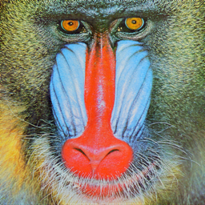
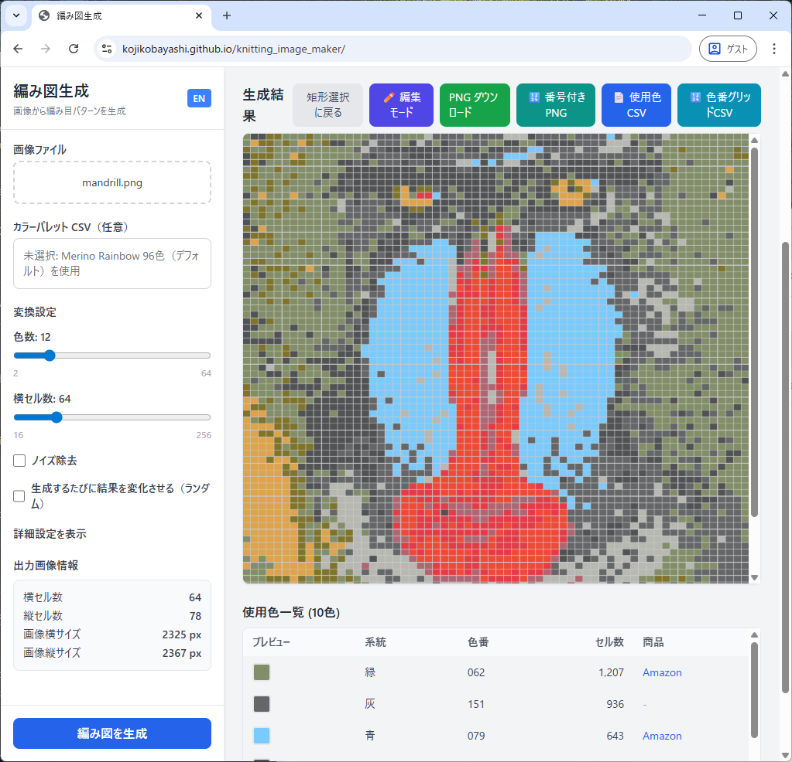

## knitting_image_maker とは

**knitting_image_maker** は、任意の画像を読み込み、編み図として使える画像に変換してくれるツールです。
色数を調整し、使用する糸を自動で選んでくれます。

手書きや専用ソフトに頼らずブラウザのみで処理が完結します。

---

## 何ができる？

#### サンプル画像

この画像をツールで処理してやると、

#### 処理結果

編み図用に減色して、糸の色を自動的に選んでくれます。この画像はダウンロードして印刷が可能です。

他にもいくつかの機能があります。
- サイズを設定できます。
- 使用する糸の数を設定できます。
- 処理結果はブラウザ上で編集可能です。
- 使用する毛糸の色はリストで設定できます。
- 他にもいくつか設定項目があります。
